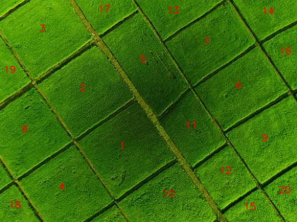

# Farmland Contour Detection and Sorting using OpenCV

This project processes an aerial farmland image to detect and **sort the land plots from biggest to smallest** using OpenCV.

## Main Purpose

To identify individual farmland plots in a satellite image and sort them by area — from largest to smallest — based on detected contours.

## How It Works

1. **Image Preprocessing**
   - Reads the image and adds a white rectangle around the border to close incomplete contours near the image edges.
   - Converts the image to grayscale.
   - Applies a **bilateral filter** to reduce noise while keeping edges sharp.

2. **Edge Detection and Morphology**
   - Uses **Canny edge detection** to find edges.
   - Applies **morphological dilation** to close gaps in the edges.

3. **Contour Detection and Filtering**
   - Finds all contours in the image.
   - Removes small contours (area < 500 pixels).
   - Approximates each contour’s shape to simplify them.

4. **Sorting and Labeling**
   - Sorts the contours **by area (descending)**.
   - Labels each field with its rank (1 = largest plot) on the image.

5. **Visualization**
   - Uses `matplotlib` to show:
     - Bilateral filtered image
     - Canny edges
     - Morphological operations
     - Final detected and ranked land plots
    

  
<b>Figure 1:</b> Labeled farm lands from largest(1) to smallest
 

---
**Course:** Multimedia    
**University:** Amirkabir University of Technology    
**Semester:** Spring 2024    
**Author:** Hadi Salavati